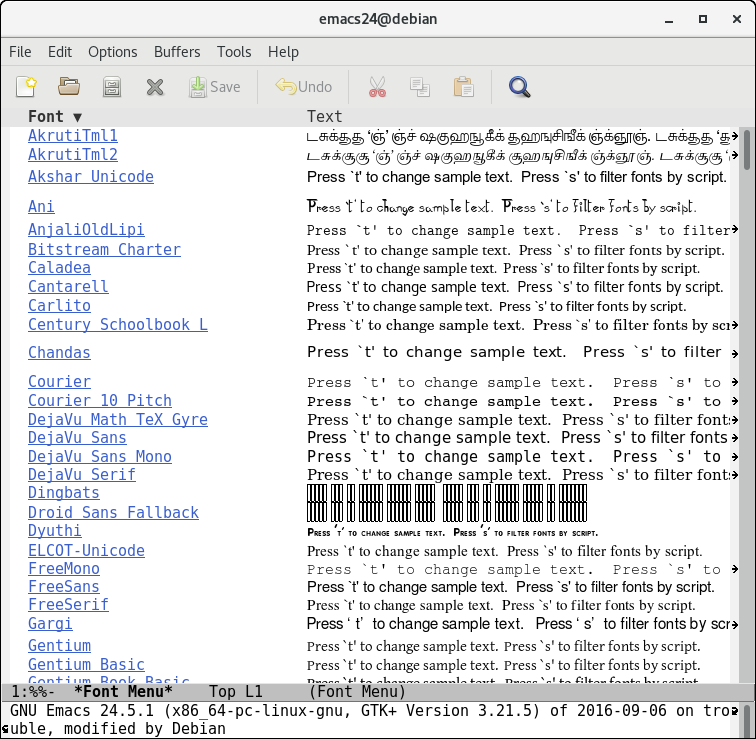
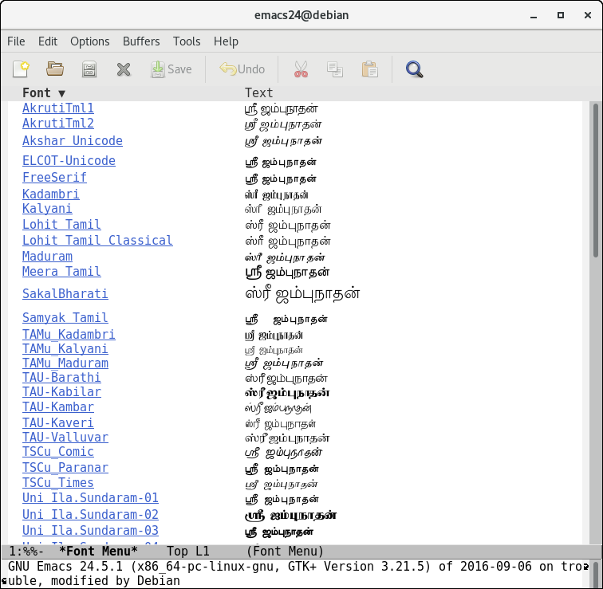
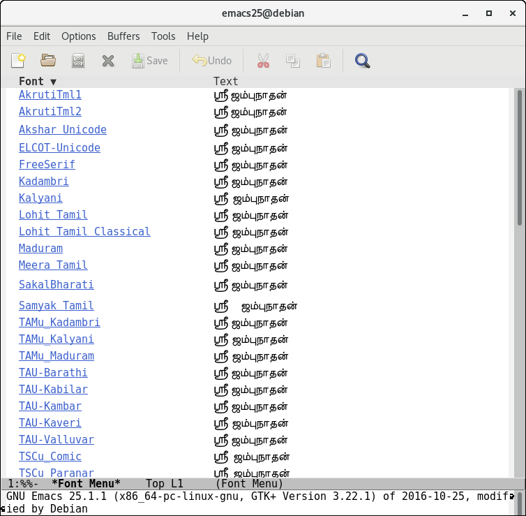

# How to

Load the file `fontmenu.el`. A buffer named `*Font Menu*` is created.
This buffer displays a sample text in all available fonts, as below.

## Customize the Sample Text and Script 

In this buffer,

1. Press `t` to change the sample text to, say, `ஸ்ரீ ஜம்புநாதன்`.
2. Press `s` to narrow the fonts to a chosen script, say `tamil`.

The buffer now displays the new sample text only in those fonts that
support the chosen script, as below.

## Experiment with different fonts for the frame

You can press `C-m` in `*Font Menu*` buffer to change the frame font to
the one under current line.

# Issues on Emacs 25.1.1

Above steps were repeated on `Emacs 25.1.1`.  But the results were
different and not along the expected lines i.e., Emacs no longer
honors the custom `face` requested for sample text.  This is a
regression in `Emacs 25.1.1`.

